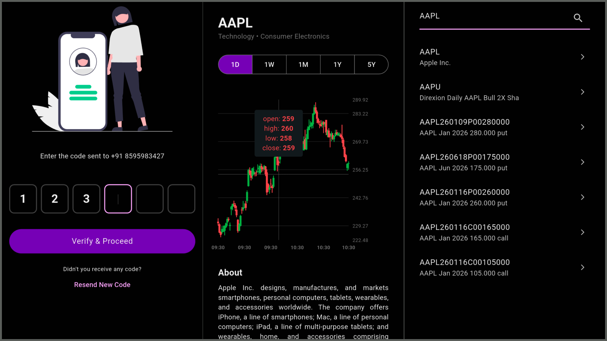

# **Market Explorer**

An app that help you keep an eye on stocks\! You can check out historical trends with a cool interactive chart and dig into company details.

<div align="center">
  
</div>

## **Getting Started**

### **1\. Grab an API Key**
1. Hop over to [RapidAPI](https://rapidapi.com) and create an account.  
2. Sign up for the free tier of the [Yahoo Finance API by Sparior](https://rapidapi.com/sparior/api/yahoo-finance15).  
3. Get your X-RapidAPI-Key from the Endpoints tab.

### **2\. Set Up Your Environment**

Make a new file called .env in the root folder of the project and paste your key in there like this: 
 ```bash
RAPID\_API\_KEY=your\_copied\_api\_key\_here
```

### **3\. Run the App**

Fire up your terminal in the project folder and run these commands to get moving:  
```bash
flutter pub get  
flutter run
```
